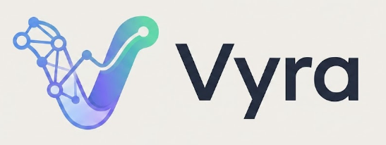

<div align="center">



**The Open-Source, AI-Powered Personal Wealth Operating System**

[](https://opensource.org/licenses/MIT)
[](https://www.python.org/)
[](https://www.djangoproject.com/)
[](https://github.com/Arjumaan/Vyra/actions/workflows/ci.yml)
[](#contributing)

[Features](#-features) • [Installation](#-installation) • [Architecture](#-architecture) • [Contributing](#-contributing)

</div>

---

## 🌟 About Vyra

**Vyra** is not just an expense tracker—it's a comprehensive **Wealth Operating System**. Built with Django, it tracks every aspect of your financial life. From daily expenses and dynamic budgets to real estate yields, debt destruction, stock & crypto portfolios, and FIRE (Financial Independence, Retire Early) planning.

Vyra gives you absolute control over your money, utilizing an AI-powered coach to provide actionable insights.

## ✨ Features

- **🏦 Core Finance:** Multi-currency engine, wallet & bank tracking, daily cash flows.
- **📈 Wealth & Assets:** Portfolios for Stocks, ETFs, Crypto, and Real Estate tracking with yield metrics.
- **🧨 Debt Destruction:** Strategy simulators for Debt Snowball & Avalanche methods.
- **🔥 FIRE Engine:** Dynamic simulator for Lean, Fat, and Barista FIRE retirement models.
- **🤖 AI Intelligence Layer:** Built-in AI coach generating monthly reports and financial insights.
- **📜 Legacy Vault:** Secure estate planner with document encryption.

## 🚀 Quickstart (Docker)
The easiest way to get Vyra running is via Docker.

```bash
git clone https://github.com/Arjumaan/Vyra.git
cd Vyra
docker-compose up --build
```
Vyra will now be accessible at `http://localhost:8000`.

## 🛠 Local Setup (Without Docker)

**1. Clone the repository**
```bash
git clone https://github.com/Arjumaan/Vyra.git
cd Vyra
```

**2. Set up Virtual Environment**
```bash
python -m venv venv
source venv/bin/activate  # On Windows: .\venv\Scripts\activate
```

**3. Install Dependencies**
```bash
pip install -r requirements.txt
```
*(If `requirements.txt` is missing, just install `django` and related libs: `pip install django`)*

**4. Migrate & Run**
```bash
python manage.py migrate
python manage.py createsuperuser
python manage.py runserver
```

## 🏗 Architecture
Vyra is designed as a **Monolithic Modular** architecture consisting of 31 fully fleshed-out Django apps. Please see our [DOCUMENTATION.md](DOCUMENTATION.md) and [BLUEPRINT](VYRA_WEALTH_OS_BLUEPRINT.md) for a deep dive into the system schemas and models.

## 🌍 The Vision: Financial Literacy for Everyone
Vyra is not just an application—it's a movement to democratize wealth management. Financial tools of this caliber are traditionally locked behind expensive wealth managers or enterprise software. Our goal is to make **top-tier financial strategy available to anyone with a computer**. We believe that true financial independence starts with clarity.

## 🧩 The Plugin Ecosystem & Localizations
Vyra is built on a highly modular architecture (31 independent apps). We are actively looking for contributors to build:
- **Regional Modules:** specific tax calculators (e.g., US 401ks, UK ISAs, Indian Provident Funds).
- **Localizations:** translations for Spanish, Mandarin, Hindi, and more.
- **Custom Engines:** new data sources, stock tickers, crypto syncs, and advanced reporting.

## 🤝 Contributing
Vyra is community-driven! We would love for you to contribute. Check out our ["Good First Issues"](https://github.com/Arjumaan/Vyra/issues) to get started! 
Please read our [CONTRIBUTING.md](CONTRIBUTING.md) for details on our code of conduct, and the process for submitting pull requests to us.

## 📝 License
This project is licensed under the MIT License - see the [LICENSE](LICENSE) file for details.
